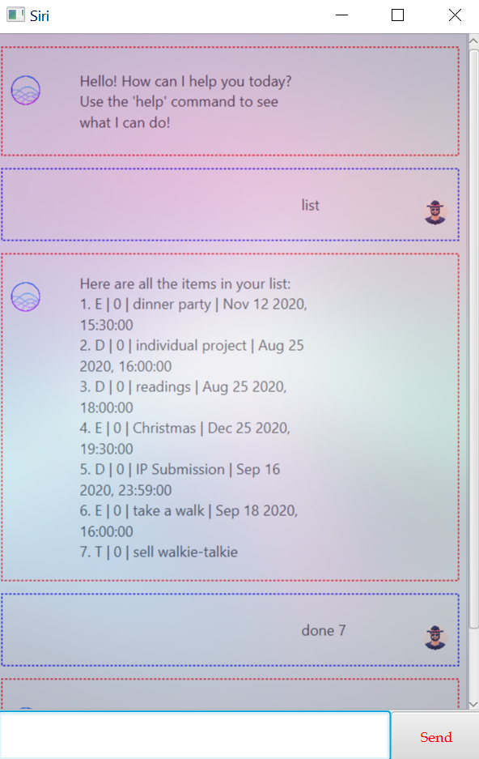

# User Guide
Siri, your personal assistant to make task management easier.



## Features 
### Create, read, update and delete task 
Manage all your different types of tasks - events, to-dos and deadlines by being able to start a new task,
update an existing task, and delete a completed task.

- Deadline and Event tasks have a completion date and time associated with them.

### Mark task as done 
Once you have completed your task, mark your task as done to see at a glance what tasks remain.

### Find specific task
Search for the exact task(s) you want to find by keywords in its description.

### List all tasks
Ask Siri to show you all the tasks that you have - completed and uncompleted.

### Undo previous change
Revert the changes you made and go back to the previous state by undoing your last command.

## Usage
### `todo <description>` - Add a new to-do item

Add a new to-do item for Siri to keep track of.

Example of usage: 

`todo walk dog`

Expected outcome:

```
Got it. I've added this task:  
   T | 0 | walk dog
Now you have 5 tasks in the list.
```

### `event <description> <YYYY/MM/DD> <HH:MM>` - Add a new event item

Add a new event item with its date for Siri to keep track of.

Example of usage: 

`event dinner 2020/12/25 13:30`

Expected outcome:

```
Got it. I've added this task:  
   T | 0 | walk dog
Now you have 5 tasks in the list.
```

### `deadline <description> <YYYY/MM/DD> <HH:MM>` - Add a new deadline item

Add a new deadline item with its completion deadline for Siri to keep track of.

Example of usage: 

`keyword (optional arguments)`

Expected outcome:

`outcome`
